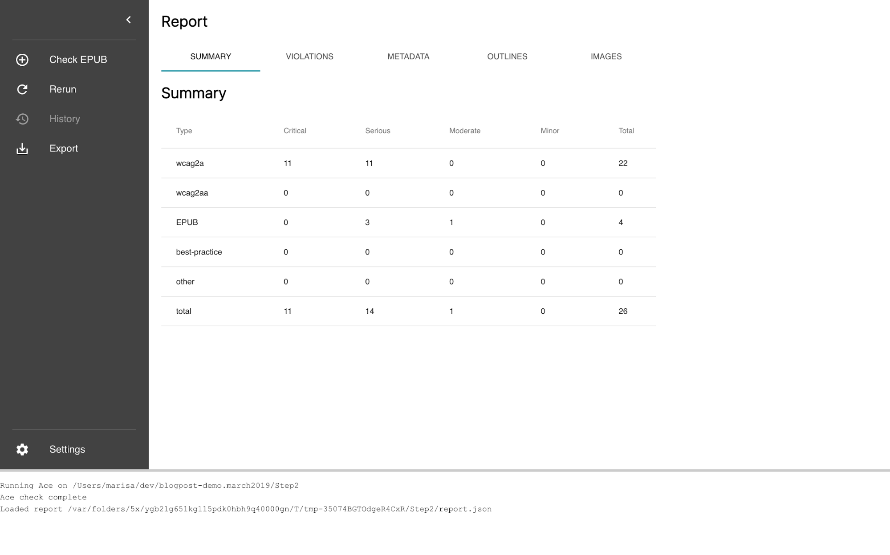
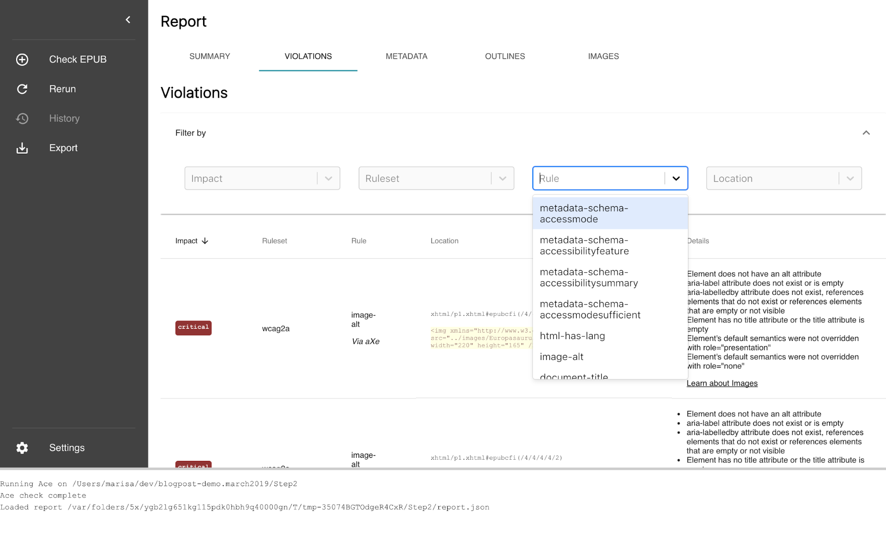
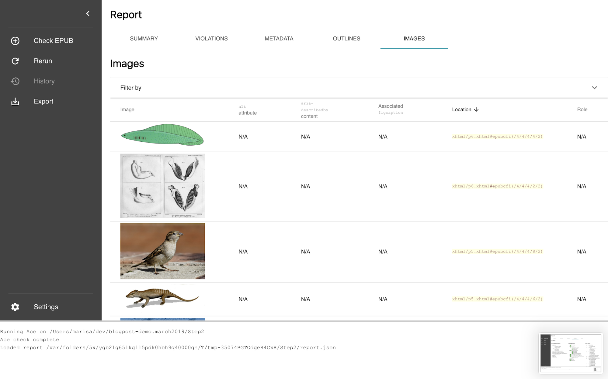
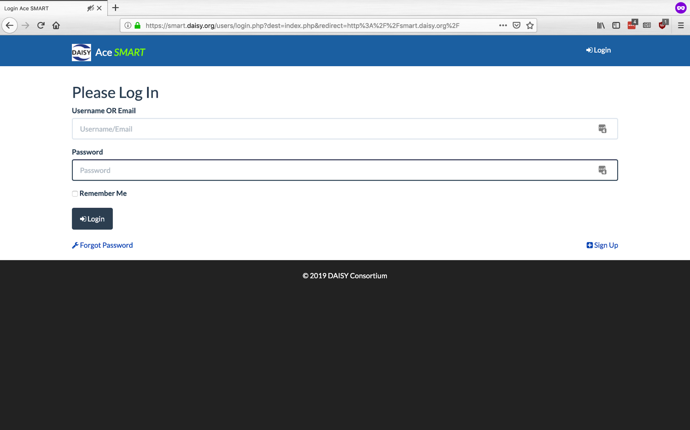
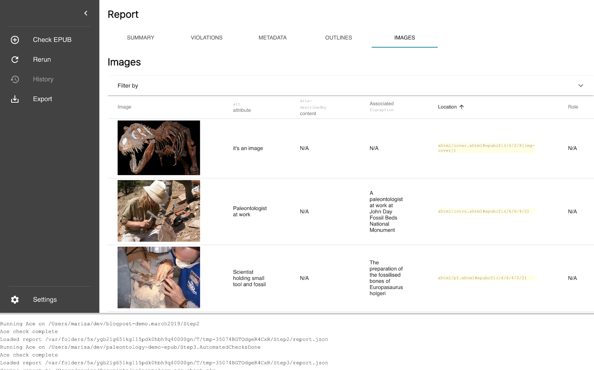
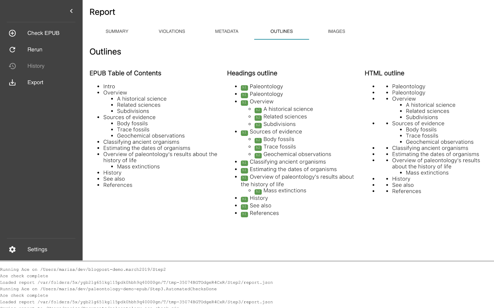
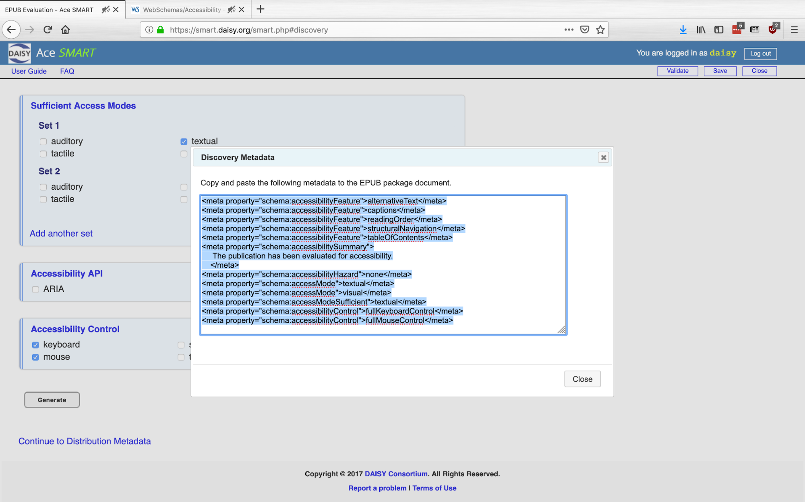
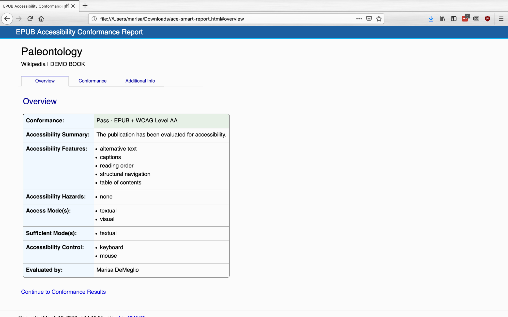

# ACT in 3 Acts: An overview of EPUB Accessibility Conformance Testing

12 March 2019

Marisa DeMeglio

Hello! So, you wanna make an accessible EPUB - that’s awesome! Not only are you setting a great example by thoughtfully formatting the information you’re putting out into the world, you’re also reaching more markets and perhaps even complying with laws in your region.

This post intends to walk you through the steps in verifying that an EPUB publication is accessible (it will not really cover how you create it in the first place). We will spend some time with tools that help the process to go faster, and talk about how to make corrections based on feedback from those tools.

For this post, I’ve made a new sample EPUB, quickly hand-coded from the [wikipedia page on Paleontology](https://wikipedia.org/wiki/Paleontology). I just wanted some new content to work with, instead of the same old demo books, and also, I think if you’re a person like me who works on EPUB standards and writes EPUB-centric software, that you should also, from time to time, make an actual EPUB that’s more than a few test sentences. Will it be perfect? No. But what it is, will be accessible.

So, fast-forward past a lot of copy-pasting, a bit of cursing, a few moments of “why did I think this was a good idea instead of using Moby Dick,” and some light CSS tweaks; and the sample files we’re using can be found in this [github repository](https://github.com/marisademeglio/paleontology-demo-epub/).

There are different folders in the repository, each representing a version of the book in one of the steps below. Many of those versions have errors, so if you’re looking for a sample to copy, go right to [`Step4.Accessible`](https://github.com/marisademeglio/paleontology-demo-epub/tree/master/Step4.Accessible). For this blog post, we’ll start with what’s in the folder called [`Step1.NotValidYet`](https://github.com/marisademeglio/paleontology-demo-epub/tree/master/Step1.NotValidYet).

## Validation

Before we can start accessibility conformance testing, let’s make sure that our publication validates. This doesn’t necessarily relate to finding accessibility issues but it’s something we have to do anyway, so why not take a minute and go over it.

When you create an EPUB fileset, the rules for what files must be included and how they should be formatted is defined by a standard. The most current EPUB standard, as of March 2019, is version 3 (with 3.2 is on its way). Running your publication’s fileset through a validation tool will tell you if it’s compliant or if there are warnings and errors.

We’ll be using a free and open source tool called [EPUBCheck](https://github.com/w3c/epubcheck/) to validate our fileset. If you’re playing along from home, you can download EPUBCheck from [the releases page](https://github.com/w3c/epubcheck/releases/) and run it from the command line.

In the example below, I downloaded and unzipped the brand-new beta of EPUBCheck 4.2 into
`~/Downloads/epubcheck-4.2.0-beta/`

Go to the directory containing the book:

```$ cd ./paleontology-demo-epub/Step1.NotValidYet```

Run EPUBCheck on the folder containing our EPUB:

```$ java -jar ~/Downloads/epubcheck-4.2.0-beta/epubcheck.jar --mode exp .```

And sit back and wait for the all-clear! Or, as it turns out, the not-at-all-clear:

```
Validating using EPUB version 3.2 rules.
ERROR(OPF-004d): ..epub/EPUB/package.opf(2,142): Invalid prefix declaration: prefix 'cc' must be separated by its URI with a space.
ERROR(OPF-028): ..epub/EPUB/package.opf(13,83): Undeclared prefix: 'cc'.
ERROR(OPF-028): ..epub/EPUB/package.opf(14,89): Undeclared prefix: 'cc'.
ERROR(RSC-005): ..epub/EPUB/package.opf(20,60): Error while parsing file: value of attribute "media-type" is invalid; must be a string matching the regular expression "[a-zA-Z0-9!#$&+\-\^_]+/[a-zA-Z0-9!#$&+\-\^_]+.*"
ERROR(RSC-005): ..epub/EPUB/package.opf(24,92): Error while parsing file: value of attribute "media-type" is invalid; must be a string matching the regular expression "[a-zA-Z0-9!#$&+\-\^_]+/[a-zA-Z0-9!#$&+\-\^_]+.*"
ERROR(RSC-005): ..epub/EPUB/package.opf(28,79): Error while parsing file: value of attribute "media-type" is invalid; must be a string matching the regular expression "[a-zA-Z0-9!#$&+\-\^_]+/[a-zA-Z0-9!#$&+\-\^_]+.*"
ERROR(OPF-074): ..epub/EPUB/package.opf(22,94): Package resource 'EPUB/images/TREX.jpg' is declared in several manifest item.
ERROR(RSC-001): ..epub/Step1.NotValidYet.epub(-1,-1): File 'EPUB/fonts/Quicksand_Light.otf' could not be found.
ERROR(RSC-001): ..epub/Step1.NotValidYet.epub(-1,-1): File 'EPUB/fonts/Quicksand_Bold_Oblique.otf' could not be found.
ERROR(CSS-010): ..epub/EPUB/xhtml/cover.xhtml(6,72): Stylesheet of type other than 'text/css' must have a fallback.
ERROR(CSS-010): ..epub/EPUB/xhtml/toc.xhtml(6,72): Stylesheet of type other than 'text/css' must have a fallback.
WARNING(RSC-017): ..epub/EPUB/xhtml/toc.xhtml(4,10): Warning while parsing file: The 'head' element should have a 'title' child element.
ERROR(CSS-010): ..epub/EPUB/xhtml/intro.xhtml(6,74): Stylesheet of type other than 'text/css' must have a fallback.
ERROR(CSS-010): ..epub/EPUB/xhtml/p1.xhtml(6,74): Stylesheet of type other than 'text/css' must have a fallback.
ERROR(CSS-010): ..epub/EPUB/xhtml/p2.xhtml(6,74): Stylesheet of type other than 'text/css' must have a fallback.
ERROR(CSS-010): ..epub/EPUB/xhtml/p3.xhtml(6,74): Stylesheet of type other than 'text/css' must have a fallback.
ERROR(CSS-010): ..epub/EPUB/xhtml/p4.xhtml(6,74): Stylesheet of type other than 'text/css' must have a fallback.
ERROR(CSS-010): ..epub/EPUB/xhtml/p5.xhtml(6,74): Stylesheet of type other than 'text/css' must have a fallback.
ERROR(RSC-005): ..epub/EPUB/xhtml/p5.xhtml(89,15): Error while parsing file: element "dd" not allowed yet; expected the element end-tag or element "div", "dt", "script" or "template"
ERROR(RSC-005): ..epub/EPUB/xhtml/p5.xhtml(89,23): Error while parsing file: element "dd" not allowed yet; expected the element end-tag or element "div", "dt", "script" or "template"
ERROR(CSS-010): ..epub/EPUB/xhtml/p6.xhtml(6,74): Stylesheet of type other than 'text/css' must have a fallback.
ERROR(CSS-010): ..epub/EPUB/xhtml/p7.xhtml(6,74): Stylesheet of type other than 'text/css' must have a fallback.
ERROR(CSS-010): ..epub/EPUB/xhtml/refs.xhtml(6,74): Stylesheet of type other than 'text/css' must have a fallback.
ERROR(RSC-005): ..epub/EPUB/xhtml/refs.xhtml(78,11): Error while parsing file: element "dl" not allowed here; expected the element end-tag, text, element "a", "abbr", "area", "audio", "b", "bdi", "bdo", "br", "button", "canvas", "cite", "code", "data", "datalist", "del", "dfn", "em", "embed", "i", "iframe", "img", "input", "ins", "kbd", "label", "link", "map", "mark", "meta", "meter", "ns1:switch", "ns2:math", "ns3:svg", "object", "output", "picture", "progress", "q", "ruby", "s", "samp", "script", "select", "small", "span", "strong", "sub", "sup", "template", "textarea", "time", "u", "var", "video" or "wbr" (with xmlns:ns1="http://www.idpf.org/2007/ops" xmlns:ns2="http://www.w3.org/1998/Math/MathML" xmlns:ns3="http://www.w3.org/2000/svg") or an element from another namespace
ERROR(RSC-005): ..epub/EPUB/xhtml/refs.xhtml(78,15): Error while parsing file: element "dd" not allowed yet; expected the element end-tag or element "div", "dt", "script" or "template"
ERROR(MED-003): ..epub/EPUB/xhtml/p3.xhtml(21,92): Non-standard image resource of type TODO found.
ERROR(RSC-007): ..epub/EPUB/xhtml/refs.xhtml(159,466): Referenced resource 'EPUB/xhtml/w/index.php' could not be found in the EPUB.
WARNING(OPF-003): ..epub/Step1.NotValidYet.epub(-1,-1): Item 'EPUB/fonts/TruenoBd.otf' exists in the EPUB, but is not declared in the OPF manifest.
WARNING(OPF-003): ..epub/Step1.NotValidYet.epub(-1,-1): Item 'EPUB/fonts/TruenoLt.otf' exists in the EPUB, but is not declared in the OPF manifest.
WARNING(OPF-003): ..epub/Step1NotValidYet.epub(-1,-1): Item 'EPUB/fonts/TruenoLtIt.otf' exists in the EPUB, but is not declared in the OPF manifest.

Check finished with errors
Messages: 0 fatal / 26 errors / 4 warnings / 0 info

EPUBCheck completed
$
```

Well that output looks a bit scary. But let’s take a closer look. In this case, there are a lot of errors in the package document, and a few stray markup errors elsewhere. Many look like typos and things I forgot (e.g. `media-type=”TODO”`). Rather than go over each and every error, I’m going to tell you that I fixed the problems in the package document first, referencing the [EPUB specification](https://w3c.github.io/publ-epub-revision/epub32/spec/epub-spec.html)  when I needed clarity on the rules. This cleared up a lot of other errors throughout; and was left with just a handful of easily resolved markup issues. E.g.

As far as I can tell, this was an attempt to quote some text, but the markup had errors when ported from wikipedia to an XHTML context. (EPUB 3’s text files are XHTML, which is stricter than your average HTML web page):

```
<dl>
  <dd>
    <dl>
      <dd>
      "the number of distinct genera alive at any given time; that is, those whose first occurrence predates and whose last occurrence postdates that time"
        <sup id="cite_ref-RohdeMuller2005_97-0" class="reference">
          <a href="refs.xhtml#cite_note-RohdeMuller2005-97">&#91;97&#93;</a>
        </sup>
      </dd>
    </dl>
  </dd>
</dl>
```

So, I replaced it with this, which works just as well:

```
<blockquote>
  "the number of distinct genera alive at any given time; that is, those whose first occurrence predates and whose last occurrence postdates that time"
  <sup id="cite_ref-RohdeMuller2005_97-0" class="reference">
      <a href="refs.xhtml#cite_note-RohdeMuller2005-97">&#91;97&#93;</a>
  </sup>
</blockquote>
```

There were one or two other cases like the above example, and that bit of editing was all that was required. The corrected files are in the [`Step2.NotAccessibleYet`](https://github.com/marisademeglio/paleontology-demo-epub/tree/master/Step2.NotAccessibleYet) folder. So let’s go to that folder and check again:

```
$cd ../Step2.NotAccessibleYet
$ java -jar ~/Downloads/epubcheck-4.2.0-beta/epubcheck.jar --mode exp .
Validating using EPUB version 3.2 rules.
No errors or warnings detected.
Messages: 0 fatal / 0 errors / 0 warnings / 0 info
EPUBCheck completed
```

Great, so now our book is valid EPUB 3.2!

## Automated testing
Now we can start testing our newly-validated EPUB for accessibility. The first step is to run it through an automated checker.

The first thing to know about automated accessibility testing is that it covers around [30% of the total task of accessibility checking](https://www.deque.com/blog/accessibility-testing-axe-webdriverjs/#post-15746). The rest has to be done manually, but don’t worry, there are tools to help with that too.

We’re going to use [Ace by DAISY](https://daisy.github.io/ace/) to do our automated checking. [Full disclosure, Romain and I are both developers of Ace.] Ace is free and open source, and you can install it by following [these instructions](https://daisy.github.io/ace/getting-started/installation/).

Hang on, that’s the command line version. It generates the same report, so it would be just fine. But I’m going to show the GUI version, newly developed, and with a public beta coming soon. If you were feeling intrepid, you could check out the project from [github](https://github.com/daisy/ace-gui) and build it yourself, and while it’s a few issues shy of release, it works quite well.

You just drop your EPUB folder or file on the logo (or sidebar)! And then it spins and thinks a bit…


And then you get a report about your EPUB, organized into five tabs: summary, violations, metadata, outlines, and images:



We’re going to look at the “Violations” tab, which shows a table where each row represents an violation found in the book. The rows can be filtered by several properties, such as the rule that triggered the violation, or the file in which it was found.



I see that our book has a lot of missing `alt` attributes, some missing metadata, a few minor things, and one case of an empty `title` element, which EPUBCheck didn’t care about (it cares that there is a `title` element, but not what it contains).

The rightmost column in the table describes possible causes for each violation, and includes a link where you can learn more about that topic. This link will take you to the relevant page in the [DAISY Accessible Publishing Knowledge Base](http://kb.daisy.org/), where you’ll find a topic overview, techniques, and examples.

First, I’ll tackle the images. In addition to the Accessible Publishing KB, I’m going to reference [The DIAGRAM Center](http://diagramcenter.org/59-image-guidelines-for-epub-3.html) for guidance. Ace’s “Images” tab shows all the images in the EPUB, along with their `alt` text, `aria-described-by` content, and associated `figcaption`, so this is a quick way to see what needs attention.



With my text editor open, I noticed that I had created `aside` elements for each image and caption, just treating them as generic secondary content:
```
<aside>
  
  <p>Analyses using <a href="https://wikipedia.org/wiki/Engineering" title="Engineering">engineering</a> techniques show that <i><a href="https://wikipedia.org/wiki/Tyrannosaurus" title="Tyrannosaurus">Tyrannosaurus</a></i> had a devastating bite, but raise doubts about how fast it could move.</p>
</aside>
```
but really, a `figure` would be more semantically appropriate. So while the old markup could have been made accessible by editing the `alt` attribute, I decided to also reformat things a bit (including corresponding changes in the CSS):

```
<figure>
    
    <figcaption>Analyses using <a href="https://wikipedia.org/wiki/Engineering" title="Engineering">engineering</a> techniques show that <i><a href="https://wikipedia.org/wiki/Tyrannosaurus" title="Tyrannosaurus">Tyrannosaurus</a></i> had a devastating bite, but raise doubts about how fast it could move.</figcaption>
</figure>
```

All the images should be sorted out now. If I wanted, I could re-run Ace to check again.

The next thing to look at is metadata. Ace reported some violations related to metadata; in addition, the “Metadata” tab shows me which accessibility metadata is missing.

Note that here, “Missing” does not mean “Must have”; it just means that it’s not there.

Not all accessibility metadata is required, but it’s good to use as much as is relevant to your publication. I’ll use the [EPUB Accessibility 1.0  Specification](http://www.idpf.org/epub/a11y/accessibility.html) as a reference for the metadata requirements.

As a result, I added the following to the package document:
```
<meta property="schema:accessMode">textual, visual</meta>
    <meta property="schema:accessibilityFeature">alternativeText</meta>
    <meta property="schema:accessibilityHazard">none</meta>
    <meta property="schema:accessibilitySummary">
     The publication has been partially evaluated for accessibility.
    </meta>
    <meta property="schema:accessModeSufficient">textual</meta>
```
So, now I’ve addressed all the issues reported by Ace. I’m going to re-run both EPUBCheck and Ace to make sure we're good to go.


```
$ cd ../Step3.AutomatedChecksDone
$ java -jar ~/Downloads/epubcheck-4.2.0-beta/epubcheck.jar --mode exp .
Validating using EPUB version 3.2 rules.
No errors or warnings detected.
Messages: 0 fatal / 0 errors / 0 warnings / 0 info
```


This is exciting! No errors and no accessibility violations. These tools really should show a little celebratory animation or something. Someone should tell the developers…

The corrected files have been saved under [`Step3.AutomatedChecksDone`](https://github.com/marisademeglio/paleontology-demo-epub/tree/master/Step3.AutomatedChecksDone), which is what we’ll start the next section with.

I also want to save my Ace report, so go under the File menu and choose “Export Report”. This gives me a zipfile containing two versions of the report: the raw JSON data, and the more visually-appealing HTML version. Unzip the archive and have `report.json` ready for the next part.

## Manual testing
Our EPUB is in pretty good shape at this point - we’ve fixed all the problems that automated tools could find. Take a break and celebrate!

Ok, not so fast. This book isn’t accessible yet. As you might imagine, it’s not possible at this point in history for a computer to tell you if your image description is accurate or your pages are arranged in a meaningful sequence. That’s where manual testing comes into play.

Manual testing can be the most tedious and overlooked part of accessibility testing, but we can use a tool called SMART to lighten the load significantly. It picks up where Ace left off.

SMART is a web-based tool. Go to the [SMART homepage](https://smart.daisy.org) and click “sign up” to try it out:


Drag and drop the `report.json` file saved from Ace into SMART. This tells it about the different features of your book, and SMART intelligently filters a series of checkpoints based on your content. For example, there’s no point in spending time on audio or video checkpoints if your book contains neither.

You might be wondering where these checkpoints come from -  if you look at the [EPUB Accessibility specification](http://www.idpf.org/epub/a11y/accessibility.html), you’ll get an idea. They include things like checks that come from WCAG, for example, regarding images; and EPUB-specific topics such as checking that your spine is arranged logically.

So, let’s go through the checkpoints and see how our book looks. We won’t go over every single checkpoint together, but the examples below should give you a good idea of what SMART does.

I’m going to keep my Ace “images” tab open while i skim the images list, while I verify what SMART is asking about how I use `alt` and `figcaption`.



Oh hang on, what’s that T. Rex on the cover have? `alt=“It’s an image”`? Let’s fix that so it’s a little more useful.

After reviewing the images, I move on to the content structure, making sure the order looks good and the headings are in order. I can use Ace’s outlines tab for a high-level overview:



Then, back in SMART, I can sign off on those checkpoints by marking them as “Pass”, and continue along through the checkpoints. I notice that many are grayed-out because they are about topics not relevant to my publication (e.g. video captioning).

I notice under “contrast”, SMART notes that if I haven’t run Ace, I need to go over this section manually, without a doubt. However, I ran Ace, which would have let me know if I was failing contrast minimums, so I feel pretty good about this part too.

Next, SMART helped me generate some better metadata than what I had added previously. I hadn’t been as thorough as I could have been.

```
<meta property="schema:accessibilityFeature">alternativeText</meta>
<meta property="schema:accessibilityFeature">captions</meta>
<meta property="schema:accessibilityFeature">readingOrder</meta>
<meta property="schema:accessibilityFeature">structuralNavigation</meta>
<meta property="schema:accessibilityFeature">tableOfContents</meta>
<meta property="schema:accessibilitySummary">
     The publication has been evaluated for accessibility.
    </meta>
<meta property="schema:accessibilityHazard">none</meta>
<meta property="schema:accessMode">textual</meta>
<meta property="schema:accessMode">visual</meta>
<meta property="schema:accessModeSufficient">textual</meta>
<meta property="schema:accessibilityControl">fullKeyboardControl</meta>
<meta property="schema:accessibilityControl">fullMouseControl</meta>
```



Proceeding through the rest of SMART’s prompts and checkpoints gives me a chance to create metadata for an ONIX record and also certify this publication as accessible. SMART ends by generating a report, summarizing your publication’s accessibility:



Reminder to run EPUBCheck again if you've edited your files at all since the last time we ran it.

## Conclusion
I still see room for improvement, so I hope one day I can continue this post by experimenting with some of the charts from the original article that were left out here. There was a lot of really weird markup on these, so making them accessible is definitely an interesting challenge.

Even with the relatively simple text I prepared for this example, I saved a lot of time by using tools to help me do accessibility testing. They considerably reduced the tedium by providing automated analysis and guided manual checks; and they also gave appropriate reference information about important concepts along the way.

The goal of this post was to show the steps of accessibility conformance testing for EPUBs, using currently-available resources. The tools used here are actively being further developed and will continue to benefit from your support and involvement.

Thanks to [Romain Deltour](twitter.com/rdeltour) for his help editing this post.

# Resources
* [Sample files used here](https://github.com/marisademeglio/paleontology-demo-epub/)
* [EPUBCheck](https://github.com/w3c/epubcheck)
* [Ace by DAISY](https://github.io/daisy/ace)
* [SMART](https://smart.daisy.org)
* [EPUB 3.2 draft specification](https://w3c.github.io/publ-epub-revision/epub32/spec/epub-spec.html)
* [EPUB Accessibility 1.0 specification](http://www.idpf.org/epub/a11y/accessibility.html)
* [DAISY Accessible Publishing KB](https://kb.daisy.org)
* [DIAGRAM Center image description guidelines](http://diagramcenter.org/59-image-guidelines-for-epub-3.html)
